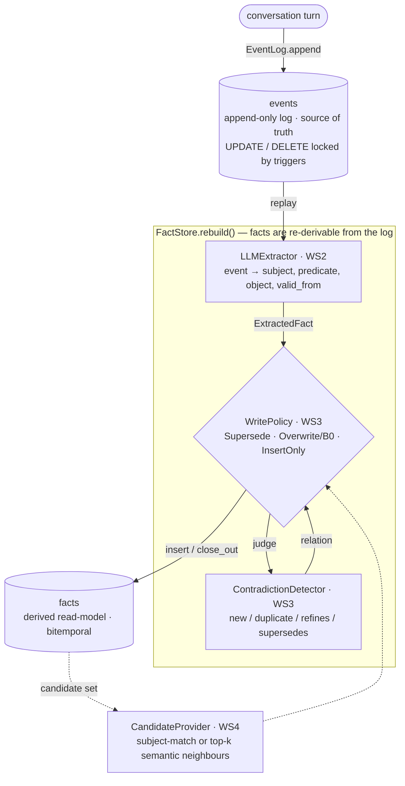
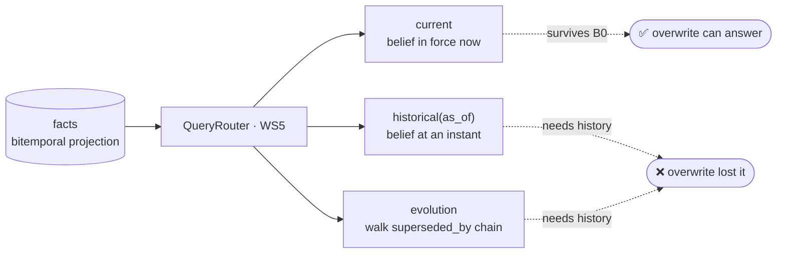
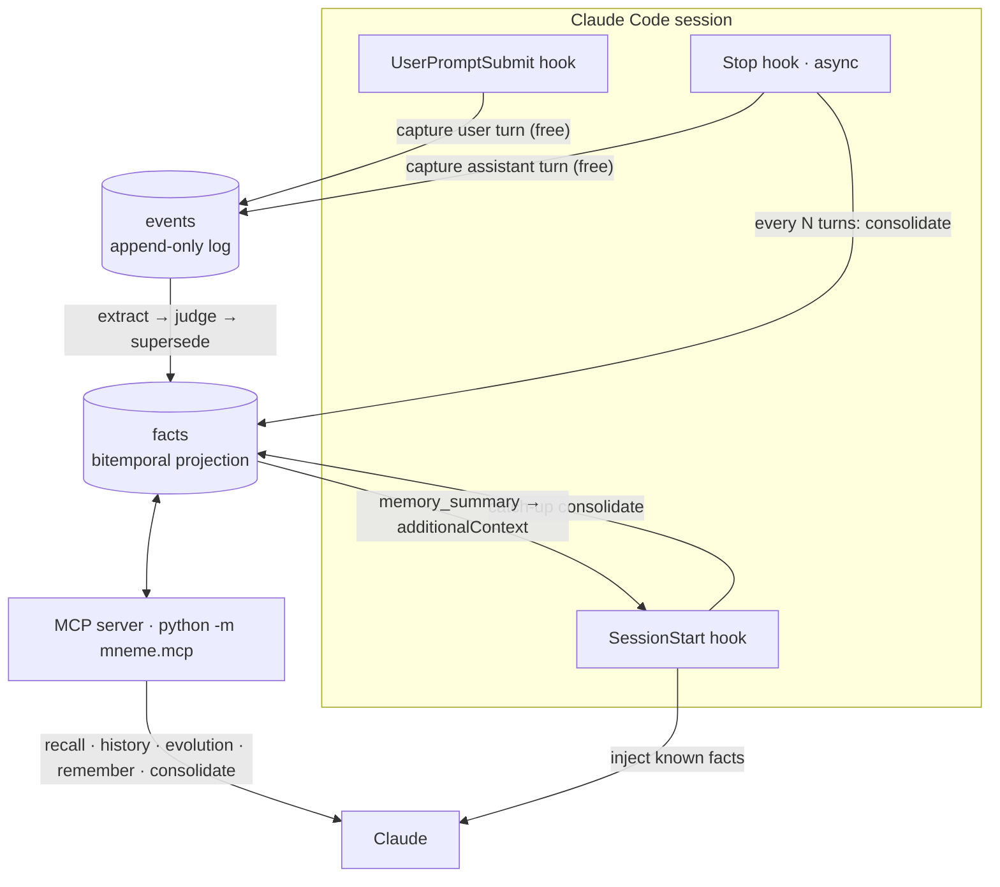

<p align="center">
  
</p>
<h3 align="center">
Μνήμη
</h3>
<p align="center">is an Ancient Greek word meaning: memory, remembrance, or the faculty of memory.</p>
<h2 align="center">A From-First-Principles Architecture for AI Long-Term Memory</h2>

<div>
TL;DR: I'm trying to build a three-layer, append-only "engram store" with a shared substrate, not three databases.
A single immutable, content-addressed event log (Merkle DAG) feeds three co-derived indexes — a quantized vector graph for semantic recall, an Elias-Fano/learned temporal index for exact episodic and time-travel recall, and a bitemporal knowledge graph for causal/belief evolution.
  
All three are projections of one log, so they stay consistent and share storage. Treat "forgetting" as belief revision, never as deletion. Borrow bitemporal (valid-time/transaction-time) modeling plus truth-maintenance/AGM supersession: facts get validity intervals and are invalidated (tombstoned with a successor pointer), not erased. Lossy compression is applied only to superseded content (delta-encoded against its successor), so still-valid information is never silently lost.
  
It is still in the prototype phase building on existing primitives: an LSM/log-structured store, the SDSL succinct-structures library, FAISS/DiskANN or SPANN+SPFresh for the vector layer with RaBitQ 1-bit quantization, Matryoshka-truncatable embeddings, and a Graphiti-style bitemporal graph.

The key parts that are different from other implementations are the consolidation pipeline and the shared-substrate routing, not any new ANN math.

</div>

This is not <a href="https://github.com/getzep/graphiti">Graphiti</a> but it is the nearest thing conceptually and it borrows some ideas from it. [](https://arxiv.org/abs/2501.13956)

I am not trying to build "another" graph/vector database with memory features. MNEME is an event-sourced memory operating system for AI.

---

## MVP — implemented so far

The MVP is a deliberately small Python/SQLite slice of the architecture above: **one append-only log as the source of truth, and a fact projection that is rebuildable from it.** Everything on the scaling list (Merkle DAG, Elias-Fano/learned temporal index, RaBitQ quantization, ATMS) is intentionally deferred until a measured number justifies it.

The MVP exists to settle **one** question: is supersession-based memory worth it at all? The whole project is measured against the **B0 ablation** — the same pipeline with history-preserving supersession swapped for last-write-wins overwrite. A loss to B0 means supersession was never worth the complexity. The ingest spine (WS1→WS2→WS3), the semantic candidate path (WS4), the read side (WS5), the gold dataset (WS7), and the scoring harness that turns them into the B0 number are in. The B0 gate is settled and all three external baselines are in: supersession beats raw RAG (B1) and summary (B2), and ties the faithful bitemporal store (B3) — the tie that keeps the substrate question open at MVP scale. The engine is also wired into a **Claude Code plugin** (WS8) that captures the conversation automatically and serves memory back to the model.

The B0 gate, run offline against the gold scenarios (`python scripts/eval_harness.py`):

```
system     overall  current  historical  evolution
supersede  100%     100%     100%        100%
overwrite  50%      100%     0%          33%
```

`current` is a tie — overwrite keeps the latest belief, so it answers "where does alice live now?" just fine. The gap is the whole thesis: overwrite scores **0% on `historical`** and collapses to **33% on `evolution`** (only a never-changed fact, a chain of one, survives), because it threw the past away. Supersession keeps it and answers everything.

### Ingest — the write path (WS1–WS4)



The invariant that is the whole architecture: **`events` is pure append (enforced in the schema by `UPDATE`/`DELETE` triggers), and `facts` is a projection that `FactStore.rebuild()` can throw away and re-derive from the log at any time.** If extraction improves or the projection is corrupted, you replay the log and rebuild.

### Read — the query path (WS5)



`historical` and `evolution` are the discriminator: overwrite keeps one row per slot, so a past instant resolves to nothing and the evolution chain collapses to length one. That gap is what the eval harness measures (the B0 table above).

### WS1 — schema + append-only event log

- `events` (immutable) and `facts` (derived, bitemporal: valid-time + transaction-time) tables — `mneme/db/schema.sql`.
- `EventLog.append / get / replay` — `mneme/log/event_log.py`.
- `FactStore` — `insert`, `close_out` (the supersession write), `overwrite` (the B0 destructive write), `current_for`, `slot_facts`, `current_facts`, `rebuild` — `mneme/facts/store.py`. `facts` is left mutable on purpose so the Overwrite/B0 ablation can last-write-wins in place.

### WS2 — LLM fact extractor

- `LLMExtractor` turns one event into `(subject, predicate, object, valid_from)` candidates, implementing the `Extractor` seam so it plugs straight into `FactStore.rebuild` and every baseline — `mneme/facts/llm_extractor.py`.
- One shared `LLMClient` / `AnthropicClient` serves both extraction (recall-tuned) and the contradiction judge (precision-tuned) — same model, different operating points — `mneme/llm/`.
- Model output is untrusted: the required triple is parsed strictly and raises `ExtractionError` rather than guessing, while the optional `valid_from` is best-effort — coarse forms (`2026-Q1`, `2026-03`) resolve to the period start and unrecognized dates degrade to the event timestamp with a warning, so one fuzzy date never aborts a run.

### WS3 — contradiction detector + write policies (the thesis and the risk)

- `ContradictionDetector` classifies a candidate against the facts it might touch as `new` / `duplicate` / `refines` / `supersedes`, tuned for precision and short-circuiting to `new` when there is nothing to compare against (no LLM call, no chance to hallucinate a conflict) — `mneme/facts/detector.py`. The judgment is untrusted external data, validated strictly.
- The defining error is a **false supersession** — closing out a fact that was not really contradicted — so it is tracked as its own metric.
- Three policies share one extractor and one store, so the comparison is structural and free — `mneme/facts/policy.py`:
  - `SupersedePolicy` — the thesis: on a conflict, insert the new fact and `close_out` the old one on both temporal axes, keeping full history.
  - `OverwritePolicy` — the **B0 ablation**: last-write-wins on the subject+predicate slot, in place, history gone.
  - `InsertOnlyPolicy` — the no-conflict-handling default used by `rebuild`.

### WS4 — embeddings + FAISS HNSW semantic index

- `FastEmbedEmbeddingClient` — local ONNX embeddings (`BAAI/bge-small-en-v1.5`, 384-dim), **no API key required** — `mneme/embeddings/`.
- `FaissHnswIndex` (cosine via inner product over L2-normalized vectors) wrapped by a domain-agnostic `SemanticIndex` — `mneme/index/`.
- `CandidateProvider` feeds the detector the facts worth comparing against: `SubjectCandidateProvider` (exact subject match) or `SemanticCandidateProvider` (top-k neighbours), so what you embed at fact granularity is load-bearing — `mneme/facts/candidates.py`.

### WS5 — query router

- `QueryRouter.current / historical(as_of) / evolution` over a `(subject, predicate)` slot — `mneme/query/router.py`. Deterministic and LLM-free: it takes a structured slot, not a natural-language question.
- `evolution` walks the `superseded_by` chain from its unique head, with a valid-time fallback and a seen-guard so a corrupted projection can never loop.

### WS7 — synthetic dataset + the B0 eval harness

- Hand-authored, self-checked gold scenarios: known timelines whose facts, supersession relations, and query answers are validated for internal consistency at authoring time — `mneme/eval/dataset.py`, `mneme/eval/validate.py`.
- The gold is simultaneously the **spec for the detector** (each event carries the relation it should be judged as) and the **discriminator for the B0 gate** (its `historical`/`evolution` queries are only answerable by a history-preserving store). `materialize()` renders a scenario into immutable log events.
- `ScenarioOracleDetector` swaps the LLM judge for the gold relations, so the harness runs offline and **deterministically** — holding extraction and judgment fixed so the only variable between the two systems is the storage policy — `mneme/eval/oracle.py`.
- The harness ingests each scenario into a fresh in-memory store under Supersede vs Overwrite, runs the router over every gold query, and scores answer accuracy by query kind — `mneme/eval/harness.py`, run via `scripts/eval_harness.py`. The supersede-minus-overwrite gap on `historical`/`evolution` **is** the B0 result above.
- **The scale dataset** (`mneme/eval/generator.py`): a seeded, fully procedural generator that builds **one long timeline** (~1000 events by default) over ~180 `(subject, predicate)` slots, each with a multi-step belief history buried in heavy chatter. Ground truth is correct *by construction* — the generator knows each slot's history as it builds it, so it emits the gold `current`/`historical`/`evolution` queries directly — and `validate_scenario` runs as an independent check. The toy gold is ~10 events a scenario, small enough that top-k recall pulls the whole timeline and a capable LLM reasons history out unaided; length is the only thing that breaks that, and the only place the substrate thesis can be tested. The offline structured gate over a generated ~1000-event scenario (`python scripts/generate_dataset.py`, keyless) sharpens the B0 gap — overwrite now scores **0% on both `historical` and `evolution`**, since at scale every queried slot has changed:

```
system         overall  current  historical  evolution
supersede      100%     100%     100%        100%
overwrite      38%      100%     0%          0%
b3-bitemporal  100%     100%     100%        100%
```

### WS6 — baselines: B1 raw RAG, B2 summary, B3 bitemporal

- B0 (overwrite) is free from WS3 and is scored inside the B0 gate. The **free-text** baselines don't share MNEME's structured storage — they answer in prose — so they live in `mneme/baselines/` on their own scoring path: **NL answer + LLM-as-judge**, the standard for free-text memory evals, reported _beside_ the exact-match gate rather than merged into it.
- **B1 raw RAG** (`RawRagBaseline`): embed every message (chatter included), retrieve the top-k nearest for a question, and let the model answer from that raw text alone — no facts, no supersession, no valid-time index. The naive straw man the thesis must beat. Retrieval reuses the WS4 `SemanticIndex`; the answer step is the only model call.
- **B2 summary** (`SummaryBaseline`): fold every message into one running natural-language summary, then answer from that summary alone — no raw messages kept, no embedder. Its defining failure is lossy compression: a concise summary drops superseded detail and exact dates, so `historical`/`evolution` are only answerable if the summary happened to retain them. The summary update and the answer are the only model calls.
- `LLMJudge` grades each free-text answer against the gold reference (meaning, not wording), parsed strictly into a boolean. The embedder (B1) and the LLM client are injected, so the suite runs offline with a fake embedder + scripted client; the live numbers come from `scripts/baselines_demo.py` (real embeddings + Anthropic). The free-text baselines' weakness is expected on `historical`/`evolution`, exactly where supersession earns its keep.
- **B3 bitemporal** (`BitemporalStore`) is the strong baseline, and the odd one out. It is a faithful Graphiti-like store — real bitemporal edges, invalidated in place on contradiction (Graphiti's "expired" edge), history read back by valid-time intervals — so it answers `historical`/`evolution` as well as MNEME does. Because it produces exact structured answers it is scored on the **B0 gate's exact-match path**, not the judge path: driven by the same gold relations as the supersede oracle, offline and deterministic, reported as a third row beside supersede/overwrite. The substrate difference is real: B3 has **no event log behind it** (nothing to `rebuild` from) and links nothing — where MNEME's facts are a rebuildable projection of an append-only log. At this scale the two tie (B3 ≈ supersede, both 100%), and **that tie is the point**: it keeps the substrate question open, since event-sourcing's payoff (auditability, rebuild, scale-consistency) is invisible at ~10 events.

### WS8 — Claude Code plugin: memory that captures itself

The plugin (`plugins/mneme-memory/`) turns the engine above into live memory for Claude Code: it records the conversation as you go and hands the model back what earlier sessions established. It is built on a **two-phase, cost-aware** split — capture is free and always-on; consolidation spends tokens and runs on a threshold — so a keyless machine still captures everything and simply defers extraction.



- **Capture (free, no LLM).** `UserPromptSubmit` appends the user's prompt and the async `Stop` hook appends Claude's reply, straight to the event log — `mneme/service/memory.py::capture`. Losing a turn is the only unrecoverable failure, so this half stays cheap and total; it runs with or without a key.
- **Consolidate (LLM, incremental).** When enough turns have piled up (`MNEME_CONSOLIDATE_EVERY`, default 6) the `Stop` hook folds the un-consolidated tail into facts under the Supersede policy, and `SessionStart` catches up anything left from last session. A **watermark** (`mneme/service/meta.py`) makes this resumable — a crash mid-pass loses no ground and a re-run pays only for unseen turns.
- **Recall, two ways.** `SessionStart` injects a compact summary of current beliefs as `additionalContext`, so Claude starts already knowing what was established; and the **MCP server** (`python -m mneme.mcp`) exposes the read side as tools — `recall` / `history` / `evolution` / `remember` / `consolidate` / `memory_summary` (`mneme/mcp/`). The tool logic is MCP-free and unit-tested; the server is a thin FastMCP adapter, lazily imported so the package installs without `mcp`.
- **Scope.** Memory is per-project by default (`<project>/.mneme/memory.db`); set `MNEME_SCOPE=global` for one store that follows you across projects, or `MNEME_DB` to point anywhere — `mneme/service/paths.py`. The store runs in SQLite WAL mode so the long-lived MCP process and the short-lived hooks can share the file.
- **Never break the session.** Every hook reads JSON on stdin, swallows all failures, and exits 0 with no output if MNEME is missing or the DB cannot be opened — memory is a nice-to-have, the session is not.

```bash
pip install -e '.[llm,mcp]'                                 # client + MCP server deps
claude --plugin-dir ./plugins/mneme-memory                  # load the plugin into a session
```

### Run it

```bash
pip install -e '.[dev,vectors,embeddings]'   # core + tests + FAISS + local embeddings
pytest                                         # 252 tests, no API key needed
python scripts/eval_harness.py                 # the B0 gate + B3, offline + keyless
python scripts/generate_dataset.py             # the ~1000-event scale gate, offline + keyless

pip install -e '.[llm]'                        # adds the anthropic client
ANTHROPIC_API_KEY=… python scripts/extract_demo.py     # eyeball extraction
ANTHROPIC_API_KEY=… python scripts/supersede_demo.py   # full supersession pipeline
ANTHROPIC_API_KEY=… python scripts/baselines_demo.py   # B1 raw RAG + B2 summary: NL answer + LLM judge
python scripts/semantic_demo.py                        # local embeddings + FAISS, keyless
```

**Next:** WS6 is complete and the **~1000-event scale dataset is now in** (`mneme/eval/generator.py`). The MVP gates have all been run: supersession beats overwrite (B0, the decision gate) and the naive free-text baselines (B1/B2), and ties the faithful bitemporal store (B3). The offline structured gate (supersede/overwrite/B3) already runs at scale and sharpens the B0 gap to 0% on both `historical` and `evolution`. The remaining lever is the **live, keyed B1/B2-at-scale run** — replaying the long timeline through raw RAG and the running summary, where top-k recall can no longer pull the right past message and the summary has compressed superseded states away, while structural supersession answers in O(1). The tie against B3 stays the expected verdict at MVP scale, and is exactly what motivates the deferred substrate work (Merkle DAG, Elias-Fano/learned temporal index, RaBitQ, ATMS), still held back until a measured number justifies it.
