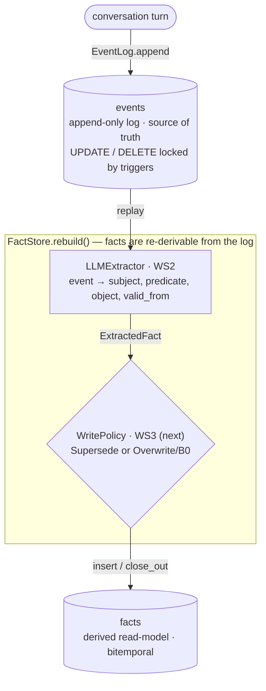

<h1 align="center">
MENEME
</h1>
<h2 align="center">A From-First-Principles Architecture for AI Long-Term Memory</h2>

<div>
TL;DR: I'm trying to build a three-layer, append-only "engram store" with a shared substrate, not three databases. 
A single immutable, content-addressed event log (Merkle DAG) feeds three co-derived indexes — a quantized vector graph for semantic recall, an Elias-Fano/learned temporal index for exact episodic and time-travel recall, and a bitemporal knowledge graph for causal/belief evolution. 
  
All three are projections of one log, so they stay consistent and share storage. Treat "forgetting" as belief revision, never as deletion. Borrow bitemporal (valid-time/transaction-time) modeling plus truth-maintenance/AGM supersession: facts get validity intervals and are invalidated (tombstoned with a successor pointer), not erased. Lossy compression is applied only to superseded content (delta-encoded against its successor), so still-valid information is never silently lost. 
  
It is still in the prototype phase building on existing primitives: an LSM/log-structured store, the SDSL succinct-structures library, FAISS/DiskANN or SPANN+SPFresh for the vector layer with RaBitQ 1-bit quantization, Matryoshka-truncatable embeddings, and a Graphiti-style bitemporal graph. 

The key parts that are different from other implementations are the consolidation pipeline and the shared-substrate routing, not any new ANN math.
</div>

This is not <a href="https://github.com/getzep/graphiti">Graphiti</a> but it is the nearest thing conceptually and it borrows some ideas from it. [](https://arxiv.org/abs/2501.13956)

I am not trying to build "another" graph/vector database with memory features. MNEME is an event-sourced memory operating system for AI.

---

## MVP — implemented so far

The MVP is a deliberately small Python/SQLite slice of the architecture above: **one append-only log as the source of truth, and a fact projection that is rebuildable from it.** Everything on the scaling list (Merkle DAG, Elias-Fano/learned temporal index, RaBitQ quantization, ATMS) is intentionally deferred until a measured number justifies it. Two workstreams are in.

### Data flow (WS1 + WS2)



The invariant that is the whole architecture: **`events` is pure append (enforced in the schema by `UPDATE`/`DELETE` triggers), and `facts` is a projection that `FactStore.rebuild()` can throw away and re-derive from the log at any time.** If extraction improves or the projection is corrupted, you replay the log and rebuild.

### WS1 — schema + append-only event log

- `events` (immutable) and `facts` (derived, bitemporal: valid-time + transaction-time) tables — `mneme/db/schema.sql`.
- `EventLog.append / get / replay` — `mneme/log/event_log.py`.
- `FactStore.insert / close_out / current_facts / rebuild` — `mneme/facts/store.py`. `close_out` is the only write-after-insert on a fact (the supersession write); `facts` is left mutable so the WS3 Overwrite/B0 ablation can last-write-wins in place.
- Seams fixed for what follows: `Extractor` (WS2) and `WritePolicy` (WS3) protocols.

### WS2 — LLM fact extractor

- `LLMExtractor` turns one event into `(subject, predicate, object, valid_from)` candidates, implementing the `Extractor` seam so it plugs straight into `FactStore.rebuild` and every baseline — `mneme/facts/llm_extractor.py`.
- One shared `LLMClient` / `AnthropicClient` serves both extraction (recall-tuned) and the WS3 contradiction judge (precision-tuned) — same model, different operating points — `mneme/llm/`.
- Model output is untrusted: parsing is strict and raises `ExtractionError` on malformed payloads rather than dropping facts silently.

### Run it

```bash
pip install -e '.[dev]'        # core + test deps
pytest                          # 45 tests

pip install -e '.[llm]'         # adds the anthropic client
ANTHROPIC_API_KEY=… python scripts/extract_demo.py   # eyeball extraction
```

**Next:** WS3 (fact store write policy + contradiction detector — the thesis and the risk, where the B0 ablation falls out for free), with WS4 (embeddings + FAISS HNSW) running in parallel to feed WS3's nearest-neighbor candidate set.
